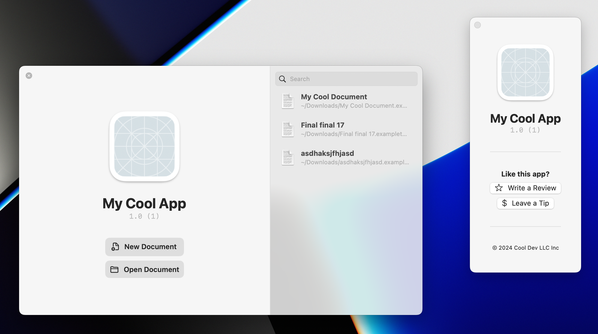

# MoreWindows
Additional `Scene` types and utilities for SwiftUI apps on macOS.



## Requirements
MoreWindows requires a SwiftUI lifecycle app on macOS 13.0 or later.

## Installation (Swift Package Manager)
Add the following line to your package dependencies.
```swift
.package(url: "https://github.com/ryanslikesocool/MoreWindows.git", from: "0.1.0"),
```

## Documentation
Documentation can be viewed by selecting Product > Build Documentation in Xcode.

## Notice
macOS 13 is supported *in theory*.
I've done my best to accomodate but I have no way of knowing if it actually works.
Please open an issue or pull request with any potential issues on macOS 13.
